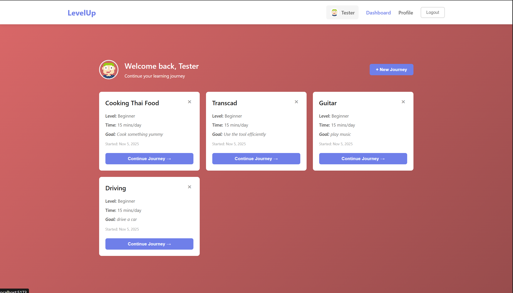

# LevelUp — AI-Powered Skill Journey Tracker  
**Web Development Project 3 — Northeastern University**

---

## 📌 Author & Class Info

- **Authors:** Hemang Murugan & Adrian Halgas  
- **Class:** Web Development — Northeastern University  
- **Date:** 11 October 2025  
- [Class Link](https://johnguerra.co/classes/webDevelopment_online_fall_2025/)

---

# 🎯 Project Objective

**An AI-Powered Skill Journey Tracker and Adaptive Learning App**

**LevelUp** is a full-stack web application where users can create learning journeys to master new skills. The app uses **Google Gemini AI** to generate personalized challenges (quests) that evolve based on the user's progress and feedback.  

This project is built using **Node + Express**, **MongoDB**, and **React (Hooks)**. The backend manages CRUD operations for users and learning journeys, while the frontend dynamically renders progress using client-side rendering.

---

## 🎥 Presentation Link

🔗 *Pending (to be added upon submission)*

---

## 🛠️ Instructions to Build / Run

### Prerequisites

- **Node.js** (v18 or later)
- **MongoDB Atlas** or local Mongo instance
- **Git** (for cloning)
- **Render** (for deployment)

### Steps

1. **Clone the repository**

   ```bash
   git clone https://github.com/iamtheretronerd/Web-dev-Project-3.git
   cd Web-dev-Project-3
   ```

2. **Backend setup**

   ```bash
   npm install
   npm run start
   or
   npm run dev
   ```

3. **Frontend setup**

   ```bash
   cd ../frontend
   npm install
   npm run dev
   ```

4. **Environment variables**

   Create `.env` files in both backend and frontend folders.

   **Backend (.env)**  
   ```env
   MONGODB_URI=<your MongoDB URI>
   PORT=3001
   GEMINI_API_KEY=<gemini api key>
   ```

   **Frontend (.env)**  
   ```env
   VITE_API_URL=https://web-dev-project-3.onrender.com
   ```

5. **Access the app**
   - Local Development: [http://localhost:5173](http://localhost:5173)  
   - Deployment: [https://web-dev-project-3.onrender.com/dashboard](https://web-dev-project-3.onrender.com/dashboard)

---

## 📸 Screenshot



---

## 📋 Assignment Rubric Checklist

| **Criterion** | **Status** | **Notes / Evidence** |
| :------------- | :--------: | :------------------- |
| **Design document including at least:** | ⚙️ Pending | Design doc with personas, stories, and mockups will be added. |
| – Project description | ⚙️ Pending | To be detailed in design document. |
| – User Personas | ⚙️ Pending | Will include 2–3 realistic personas (e.g., student, hobbyist). |
| – User stories | ⚙️ Pending | Example: “As a learner, I can create a skill journey to improve at chess.” |
| – Design mockups | ⚙️ Pending | Screenshots and Figma wireframes will be added. |
| **Does the app accomplish all approved requirements?** | ✅ | [Live App on Render](https://web-dev-project-3.onrender.com/dashboard) fully functional with CRUD and AI level generation. |
| **Is the app usable / includes instructions?** | ✅ | Detailed instructions provided in this README. |
| **Is the app actually useful?** | ✅ | Encourages users to gamify their learning progress with AI feedback. |
| **ESLint config (no errors)** | ✅ | [eslint.config.js](./eslint.config.js) passes cleanly. |
| **Code properly organized (components, DB, CSS folders)** | ✅ | Clear structure:<br>• `/backend/routes` — REST APIs<br>• `/backend/db/myMongoDB.js` — Mongo wrapper<br>• `/frontend/src/components` — React components<br>• `/frontend/src/styles` — CSS Modules |
| **Implements ≥ 3 React Components (using hooks)** | ✅ | Uses 7 components built with hooks:<br>• `Login.jsx`, `Signup.jsx`, `Dashboard.jsx`, `Profile.jsx`, `Game.jsx`, `Navigation.jsx`, `CreateJourney.jsx`.<br>Each uses `useState`, `useEffect`, and `useNavigate` for state & routing. |
| **Each React Component saved in its own file** | ✅ | [frontend/src/components/](./frontend/src/components) — Each component has a separate `.jsx` file. |
| **Project deployed publicly & functional** | ✅ | [Deployed App](https://web-dev-project-3.onrender.com/dashboard) on Render. |
| **Uses ≥2 Mongo Collections with full CRUD** | ✅ | `users`, `gameData`, `levels` collections implemented under `/backend/routes`. |
| **Database populated with ≥1k synthetic records** | ⚙️ Pending | Will populate via `seed.js`. |
| **Uses Node + Express** | ✅ | [backend.js](./backend/backend.js) entrypoint confirms Express server. |
| **All code formatted with Prettier** | ✅ | `.prettierrc` applied project-wide. |
| **No non-standard HTML tags used** | ✅ | Semantic tags only; verified via ESLint. |
| **CSS organized by components** | ✅ | [frontend/src/styles](./frontend/src/styles):<br>Each React component imports its own `.module.css` file for scoped styling. |
| **Clear and descriptive README** | ✅ | Includes all required sections, screenshots, and links. |
| **No exposed credentials** | ✅ | Secrets managed in `.env` and ignored in `.gitignore`. |
| **Separate package.json for backend & frontend** | ✅ | [Backend package.json](./backend/package.json), [Frontend package.json](./frontend/package.json). |
| **Uses MIT license** | ✅ | [LICENSE](./LICENSE) included. |
| **No leftover code (favicon, unused routes)** | ✅ | No leftover code. |
| **Google Form submission correct** | ⚙️ Pending | To be completed with working links and thumbnail. |
| **Short public narrated video demo** | ⚙️ Pending | Video to be recorded post submission. |
| **Code frozen 24h before class** | ⚙️ Pending | Final freeze planned before submission deadline. |
| **Defines PropTypes for every React component** | ✅ | All components define PropTypes for validation. |
| **Does not use axios / mongoose / cors / prohibited libraries** | ✅ | Only uses native `fetch()` and official MongoDB driver. |

---

## 🧠 GenAI Usage

This project used **GenAI tools** (ChatGPT / GPT-5) for:

- Brainstorming, code reviews, and documentation refinement.
- Validating accessibility, semantic HTML, and ESLint/Prettier consistency.

**Prompts Used:**

> “Review my code file for semantic structure, accessibility issues, and best practices.”

**The below prompt is used in the API to generate AI-based idea**

> "Generate ONE specific, actionable task that:
    1. Can be completed in ${timeCommitment}
    2. Is appropriate for a ${level} level learner
    3. Builds on previous tasks (if any)
    4. Is concrete and measurable (the user should know when they've completed it)

    Respond with ONLY the task description in 1-2 sentences. Be specific and actionable. Do not include level numbers, greetings, or explanations.

    Examples of good tasks:
    - "Cook scrambled eggs with three ingredients and serve with toast"
    - "Practice speaking for 60 seconds about your day without using filler words"
    - "Build a simple paper airplane that can fly at least 10 feet"

**Validation:**  
All outputs were manually reviewed, iterated, and integrated **only after confirming**:

- Compliance with semantic **HTML5** and **accessibility** standards
- ESLint / Prettier formatting rules
- Academic integrity and rubric compliance

---

## 👤 Authors

**Hemang Murugan**  
MS in Computer Science, Northeastern University (Khoury College)  
Course: _CS5610 — Web Development_  

**Adrian Halgas**  
MS in Computer Science, Northeastern University (Khoury College)  
Course: _CS5610 — Web Development_  

---

## 🪪 License

This project is licensed under the **MIT License** — see the [LICENSE](./LICENSE) file for details.

---

## 📎 Login Details (Sample Accounts)

You can log in with demo accounts or create your own.

| **Email** | **Password** |
|------------|--------------|
| ava.johnson@example.com | 12345678 |
| ethan.lee@example.com | 12345678 |
| sophia.patel@example.com | 12345678 |


notes
run eslint . separately in frontend folder and root
this is because the eslint.config.js is different for both
ignore if lint error comes in root for the /frontend folder and run separately in frontend folder.
